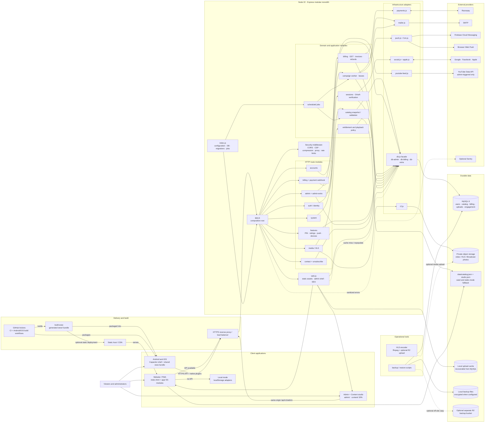
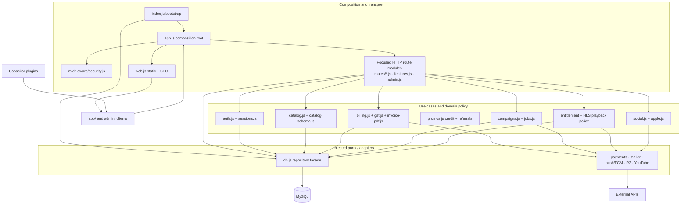
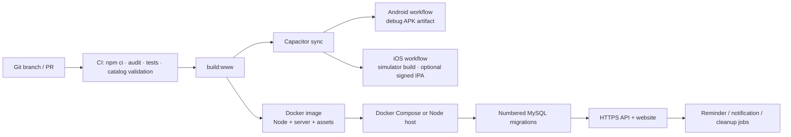

# ADDABAAZ architecture

ADDABAAZ is a **modular monolith**: one Node/Express deployment, one primary MySQL database, and clearly separated client, route, domain, persistence, and provider modules. This keeps deployment and payment transactions simple while allowing each feature to evolve behind an explicit boundary. Splitting it into microservices would add operational complexity without a current scaling need.

## System and deployment view

**Reading the diagram:** solid arrows show dependencies, calls, or labeled build/deployment flows; dotted arrows show optional or derived paths. `www/` is generated output, not a second source tree: web and native clients share the app modules. Static-only hosting can run in local mode; when an API is available, user data and paid access use the server.

## Internal module boundaries

### Ownership map

| Area | Entry modules | Owns / does not own |
|---|---|---|
| Web and PWA | `app/js/main.js`, `app/js/router.js`, `app/js/views/` | UI and navigation; reads through `User` and the data adapters, not raw `fetch`/storage calls scattered through views. |
| Client data | `app/js/data/user.js`, `app/js/data/adapters.js`, `app/js/data/api.js` | `User` is the UI-facing facade; `LocalAdapter` handles offline/guest state and `RemoteAdapter` speaks the versioned REST API. |
| Console UI | `admin/js/console.js` (shared shell), `admin/js/main.js` (full Admin), `content/js/main.js` (focused Content studio), `admin/js/views/` | `/admin` exposes both business operations and the complete CMS; `/content` is a shorter editor-focused entry point. Both share sign-in, UI toolkit and API client and call `/api/v1/admin`, never querying storage directly. |
| Native shell | `mobile/`, `mobile/scripts/`, `app/js/platform.js`, `app/js/push-native.js` | Capacitor packaging, OS permissions, deep links, native push and build-time Firebase setup. It reuses the web application bundle. |
| HTTP composition | `server/src/app.js`, `middleware/security.js`, `routes/*.js`, `web.js` | Middleware order, API version prefix, route registration, static/SEO delivery and final error mapping. Route modules receive dependencies; they do not read environment variables or create a database connection. |
| Use cases | `auth.js`, `sessions.js`, `features.js`, `billing.js`, `promos.js`, `maintenance.js`, `campaigns.js`, `catalog.js`, `jobs.js` | Identity/session policy, engagement rules, payment/invoice workflows, promotional credit & referrals, the maintenance switch, leased campaigns, catalog snapshots and scheduled work. |
| Persistence | `db.js`, `db-admin.js`, `db-billing.js`, `db-extra.js`, `migrations/` | Parameterized MySQL operations and row mapping. `db.js` composes the repository facade; HTTP modules do not issue SQL. |
| Provider adapters | `payments.js`, `mailer.js`, `push.js`, `fcm.js`, `r2.js`, `social.js`, `apple.js`, `youtube-feed.js` | External protocols and provider configuration. Domain workflows consume their narrow methods instead of SDK details. |
| Operations | `index.js`, `migrate.js`, `backup.js`, `scripts/`, `Dockerfile`, workflows | Process lifecycle, schema evolution, backups, HLS encoding, build/test/release automation. |

## Core flows

### Sign-in and profile sync

1. Web/native clients call the same `/api/v1` contract. Social credentials are verified server-side; native Google uses a short-lived, single-use ticket to move the OAuth result back to the app.
2. `routes/auth.js` validates input and delegates password/session and identity work to the auth/session modules and injected repository facade.
3. `sessions.js` resolves only first-party session tokens. Scoped media/OAuth tokens are not accepted as user sessions.
4. `RemoteAdapter` hydrates `User`; local guest list/progress remains isolated in `LocalAdapter` until the app intentionally syncs it.

### Premium media

1. `routes/media.js` asks catalog policy whether an item is premium, checks the session, subscription and playback-seat limit, and refuses unconfigured storage.
2. MP4 uses a time-limited R2 signature. HLS playlists pass through the API gateway; the gateway confines paths to the title's object prefix and redirects segments to short-lived R2 URLs.
3. YouTube/public sources are not access-controlled by ADDABAAZ. Use private object storage for assets that need server-enforced entitlement checks.

### Payment

1. Authenticated checkout validates eligibility and calls `billing.js`; payment-provider secrets stay server-side.
2. The browser signature endpoint and the signed Razorpay webhook both converge on idempotent settlement. MySQL transactions apply the payment, subscription and invoice consistently.
3. Refunds and notices use the billing domain and durable claims; failed mail claims are released for retry.
4. Promotional credit (`promos.js`) is spent inside the same checkout: the ledger is append-only, a spend holds grants until the payment settles, and abandoned orders release them from the housekeeping job. See [docs/PROMOS.md](PROMOS.md).

### Catalog and notifications

- `data/catalog.json` and `studio.json` seed the database and support static-only mode. The database is the live editable catalog once the API is used.
- YouTube is fetched only after an administrator asks for a preview. Preview snapshots/import history are stored in MySQL so import and undo can work across instances.
- Scheduled jobs announce releases, send reminders, clean up stale records and resume campaigns. Campaign workers claim a database lease and fence progress writes so separate instances do not concurrently own one campaign.

## Data ownership and consistency

| Data | System of record | Cache / derived copy |
|---|---|---|
| Accounts, identities, sessions, profiles, library, playback, subscriptions, payments, invoices, refunds | MySQL | Client-side account state is a session cache; local guest state is separate until sync. |
| Curated catalog, studio documents, moderation, YouTube preview/import records | MySQL once the API is active | JSON files seed the database and serve as static-mode fallback; catalog service keeps an in-process versioned snapshot. |
| Admin-uploaded catalog images and subtitles | MySQL `uploaded_files` | `UPLOAD_DIR` is a content-hash filesystem cache and can be rebuilt. |
| Broadcast photos | Private R2-compatible object storage under `broadcast/` | MySQL stores the campaign path; a stable app URL redirects recipients to a fresh signed GET URL. |
| Video/reel media objects | Private R2-compatible object storage | Catalog metadata and object keys stay in MySQL; delivery uses signed URLs or the HLS API gateway. |
| Push tokens, preferences, campaigns, analytics, errors | MySQL | Push provider sends are external side effects; dead native tokens are removed when providers report them. |
| Backups | Local backup volume and optional separate R2 bucket | Encryption is controlled by `BACKUP_PASSPHRASE`; backups must be copied off-host and tested with restore. |

MySQL unique keys and transactions are the cross-instance source of truth. In-memory caches and rate limits are per process; correctness-critical campaign claims therefore use database leases, while rate limits should be enforced at a shared proxy/edge or moved to a shared store when running multiple instances.

## Architecture rules

1. **Modular monolith first.** Keep a single deployment and transaction boundary until there is measured need to split a bounded context into a service.
2. **Composition at the edge.** `index.js` owns process setup; `app.js` wires collaborators. Feature modules do not construct pools, read secrets from `process.env`, or depend on the Express app.
3. **One direction inward.** Route adapters call domain/use-case modules and injected repository/provider ports. MySQL adapters own SQL; UI modules own presentation; external provider code stays behind adapters.
4. **No hidden global session state.** Session resolution is centralized; route modules receive authenticated `req.user` only after middleware. Signed scoped tokens are audience-checked.
5. **Stable API and adapter contracts.** Keep `/api/v1` and the client `UserAdapter` interface stable when replacing implementations.
6. **Acyclic dependencies.** Shared contracts/errors live in neutral modules; feature modules must not import one another in a cycle. `server/test/architecture.test.js` and `module-hygiene.test.js` enforce this.
7. **Database evolution is additive and ordered.** Make schema changes in numbered SQL migrations and keep repository operations parameterized. Use transactions/idempotency for billing and database leases for distributed workers.
8. **Keep side effects explicit.** SMTP, payment, push, object storage and OAuth are adapters; tests can inject fakes without credentials or live services.

## Build and deployment

The CI workflow runs the suite against MySQL 8, validates the catalog, builds `www/`, and checks the Docker image; it does not deploy the server. Separate GitHub Actions workflows produce the Android debug APK and iOS simulator build (a signed IPA is optional). `API_BASE` and optional Firebase client configuration are injected by the mobile build workflows. Runtime secret values belong in the host's environment/secret store, not the repository or image build context. `index.js` connects and applies numbered migrations before listening. Health is split into liveness (`/api/v1/health`) and readiness (`/api/v1/health/ready`).

## Observability, security, and known scale limits

- Passwords use asynchronous scrypt; production requires a unique random JWT secret of at least 32 bytes. Database TLS verifies the certificate chain and host by default.
- Request parsing, CORS/CSP, proxy trust, auth checks, input validation, rate limits and the final error boundary are installed centrally. Error-report URLs strip query/fragment values and HLS bearer tokens.
- Tokens are bearer credentials in the client. Native secure storage can reduce exposure compared with localStorage; browser clients rely on same-origin protections and do not use authentication cookies.
- Sentry is optional; the built-in admin Errors page remains available. Provider secrets are not returned by setup/health endpoints.
- Rate-limit counters and some caches are process-local. Use a shared edge/Redis limiter and monitor DB pool usage before increasing the instance count.
- Keep media, SMTP, payment, social-provider, push and MySQL credentials in deployment secrets. Test backup restore procedures; a successful backup alone is not a restore guarantee.

Related guides: [database and TLS](DATABASE.md), [deployment](DEPLOY-RENDER-AIVEN.md), [authentication](AUTH.md), [billing](BILLING.md), [mobile](MOBILE.md), [admin](ADMIN.md), [SEO](SEO.md), and [OpenAPI contract](openapi.yaml).

## Future evolution

The current system already includes web checkout, admin catalog and YouTube-import workflows, social sign-in, account e-mail flows (when SMTP is configured), SEO, native FCM, and browser Web Push. Treat the following as optional product work rather than missing runtime modules:

- **Native billing:** integrate Apple StoreKit / Google Play Billing (directly or through a service such as RevenueCat) before offering in-app purchases. Web checkout remains Razorpay-based; evaluate e-invoicing/IRN only if applicable to the business.
- **Premium media:** `scripts/encode-hls.mjs` and `server/src/hls.js` already build adaptive HLS and can upload to private R2. DRM (Widevine/FairPlay), offline downloads, and Chromecast/AirPlay need separate product and platform design.
- **Editorial workflow:** the admin console supports catalog edits and YouTube preview/import with undo. Consider a headless CMS only if multi-editor publishing workflows outgrow that model.
- **Analytics and discovery:** aggregate play events are available; recommendations such as “Because you watched…”, richer analytics, and hero A/B tests need explicit product, privacy, and measurement decisions.
- **Localization:** a Bengali/English language toggle would need a shared translation catalog and a pass over strings that are currently embedded in views.
- **Scale-out:** use shared edge/Redis rate limiting and review MySQL capacity before adding instances. Campaign leases and push-device tables are already database-backed; keep backups off-host and routinely test restores.
 edge/Redis rate limiting and review MySQL capacity before adding instances. Campaign leases and push-device tables are already database-backed; keep backups off-host and routinely test restores.
